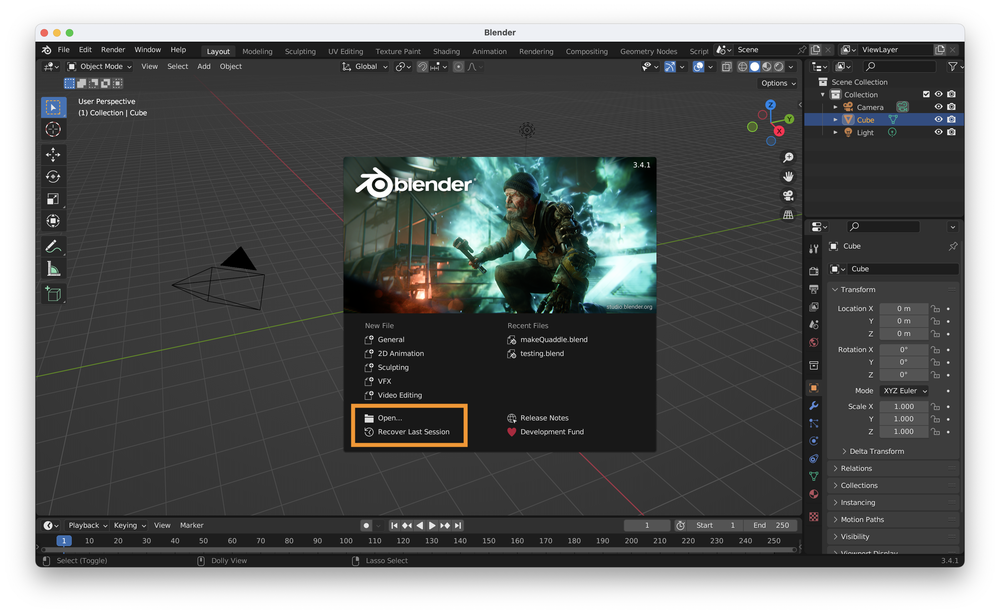
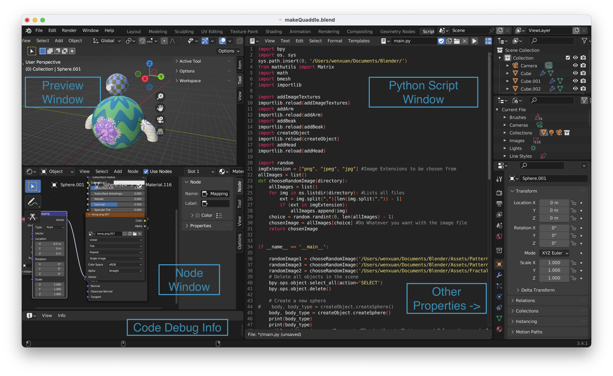
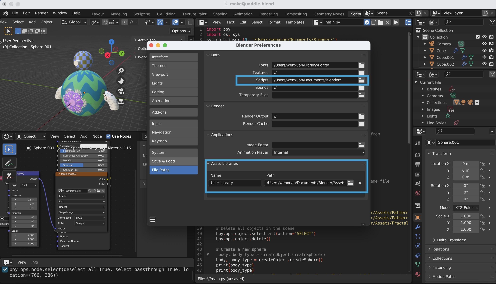
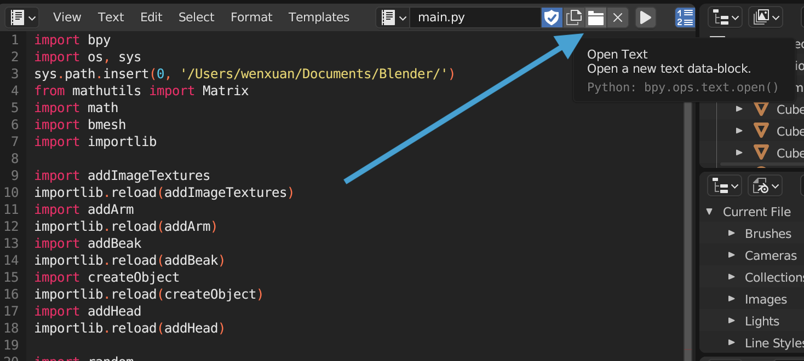
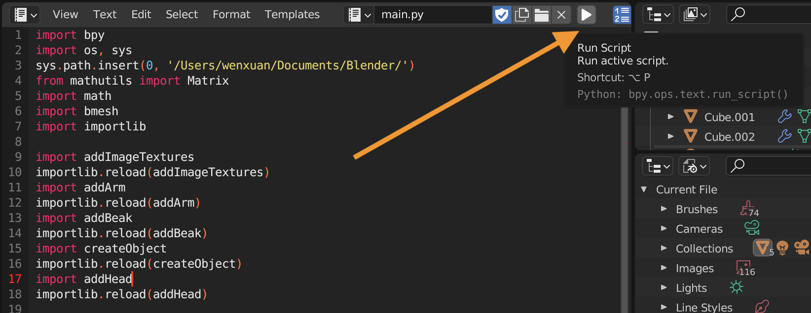

## <i>Quaddle2.0</i>: A Multidimensional 3D Stimuli for Cognitive Science Research


### Getting Start

#### Set up Blender

Once open the Blender, you will see this UI:

You can open the `makeQuaddle.blend` file and its folder containing supplementary materials. 

Then you can see the main page, containing everything you need when you generate your quaddle.


Let's first set up the python script path you need to pass to the Blender. You can find preference: `Edit -> Preference -> File Path`

Please change the `Data/Script` to the path of Blender folder (where you store the scripts from github), and `Asset Library` add the path of assets (also in the folder you downloaded).

Now you can load scripts to it! Click Open Text button:

And run it by clicking the Run button .


When you run the script for the first time, you have to run all dependent scripts (imported scripts).

---

## Basic Intro to Blender

There are many, many online materials for learning Blender, for example:    
[Blender Guru](https://www.blenderguru.com)    
[Blender Official Youtube Channel](https://www.youtube.com/playlist?list=PLa1F2ddGya_-UvuAqHAksYnB0qL9yWDO6)    
[Blender Official Doc](https://docs.blender.org)    

There are few key concepts you need to know:

import Tabs from '@theme/Tabs';
import TabItem from '@theme/TabItem';

<Tabs>
<TabItem value="python" label="Python Coding in Blender">

<div style={{
  backgroundColor: 'rgba(135, 206, 250, 0.3)',
  borderRadius: '10px',
  display: 'inline-block',
  padding: '5px 10px',
}}>
  <span style={{
    color: 'black',
  }}>
    Python is a popular programming language used in many fields, including 3D graphics and animation. In Blender, Python can be used to create and manipulate objects, automate tasks, and add custom functionality to the software.
  </span>
</div>


</TabItem>

<TabItem value="Node" label="Node">

<div style={{
  backgroundColor: 'rgba(135, 206, 250, 0.3)',
  borderRadius: '10px',
  display: 'inline-block',
  padding: '5px 10px',
}}>
  <span style={{
    color: 'black',
  }}>
In Blender, a node is a graphical element that represents a function or operation in the software's node-based editing system. Nodes are used to create materials, textures, compositing effects, and other visual elements.
  </span>
</div>

</TabItem>

<TabItem value="UVMap" label="UV Mapping">
<div style={{
  backgroundColor: 'rgba(135, 206, 250, 0.3)',
  borderRadius: '10px',
  display: 'inline-block',
  padding: '5px 10px',
}}>
  <span style={{
    color: 'black',
  }}>
UV mapping is the process of creating a 2D texture map that can be applied to a 3D model's surface. In Blender, this involves unwrapping the 3D mesh so that it can be laid out flat and assigned coordinates in a 2D space. The resulting texture map can then be painted or edited in an external software or within Blender's texture painting tools to add color and detail to the model's surface.
  </span>
</div>
</TabItem>

<TabItem value="Bake" label="Bake">

<div style={{
  backgroundColor: 'rgba(135, 206, 250, 0.3)',
  borderRadius: '10px',
  display: 'inline-block',
  padding: '5px 10px',
}}>
  <span style={{
    color: 'black',
  }}>
In Blender, baking refers to the process of transferring data from one object or element to another. For example, baking can be used to create a texture map from a high-polygon model to a low-polygon model, or to transfer lighting information from one object to another.
  </span>
</div>

</TabItem>

<TabItem value="Render" label="Render">

<div style={{
  backgroundColor: 'rgba(135, 206, 250, 0.3)',
  borderRadius: '10px',
  display: 'inline-block',
  padding: '5px 10px',
}}>
  <span style={{
    color: 'black',
  }}>
Rendering is the process of creating a 2D image or animation from a 3D scene. In Blender, the software uses a rendering engine to process the scene and produce the final output.
  </span>
</div>

</TabItem>

<TabItem value="FBX" label="FBX & PNG file">

<div style={{
  backgroundColor: 'rgba(135, 206, 250, 0.3)',
  borderRadius: '10px',
  display: 'inline-block',
  padding: '5px 10px',
}}>
  <span style={{
    color: 'black',
  }}>
FBX is a file format used to exchange 3D data between software applications, commonly used in the game development industry. PNG is a file format used for storing and transmitting raster graphics, typically used for images with transparent backgrounds or for graphics that require lossless compression. In Blender, both FBX and PNG files can be exported as outputs from a scene or imported into a project for use as assets.
  </span>
</div>

</TabItem>
</Tabs>

---

## Basic Intro to Blender Python

One of the key features of Blender is its support for Python scripting, which allows users to automate tasks and create custom tools. In this post, we'll provide a basic introduction to Blender Python, including how to access and manipulate objects, create custom operators, and more.

Let's start by creating a basic mesh object: a sphere:

```python
bpy.ops.mesh.primitive_uv_sphere_add(radius=5.0, location = (0,0,0))
sphere = bpy.context.active_object
sphere.name = 'Sphere'
```

One of the most common tasks in Blender is accessing and manipulating objects. With Python, you can easily select, move, rotate, and scale objects in your scene. Here's an example of how to select an object by name and move it along the x-axis:

```python
import bpy

# Select object by name
obj = bpy.data.objects['Sphere']
# Move object along x-axis
obj.location.x += 1.0
```

As you noticed, object on the scene can be selected by `bpy.context.active_object` (select the last operated object) or `bpy.data.objects['Sphere']` (select by name).

Another important function is **Node**, here is an example using node to add image texture on the object:

```python
import bpy

# Load an image texture
image_path = "/path/to/your/image.png"
image = bpy.data.images.load(image_path)

# Create a new material
material = bpy.data.materials.new("ImageTextureMaterial")
material.use_nodes = True

# Access the material's node tree
node_tree = material.node_tree

# Add an image texture node
image_texture_node = node_tree.nodes.new("ShaderNodeTexImage")
image_texture_node.image = image
```

---

## Connect with your workflow

One of the most powerful ways to connect Blender with your workflow is by running Blender outside of its GUI. This allows you to automate tasks, integrate Blender into your existing workflow, and use Blender as a rendering engine.  One example of this is connecting Quaddle Generator to your MATLAB workflow. By doing so, you can generate stimuli without the need for a graphical interface, streamlining the process and making it more efficient.

You simply need to add following lines:
```matlab
% Make Quaddle
export_png = 'True';
export_fbx = 'False';
blender_path = '/Applications/Blender.app/Contents/MacOS/Blender'; % Change this to your Blender path
blender_file_path = '/Users/wenxuan/Documents/Blender/makeQuaddle.blend'; 
python_script = '/Users/wenxuan/Documents/Blender/parser.py'; % Change this to your Python script path
input_path = iPath;
output_path = [iPath '/'];
command = sprintf('"%s" --background "%s" --python "%s" -- --input_path "%s" --output_path "%s" --export_fbx "%s" --export_png "%s"', blender_path, blender_file_path, python_script, input_path, output_path, export_fbx, export_png);
system(command);
```

